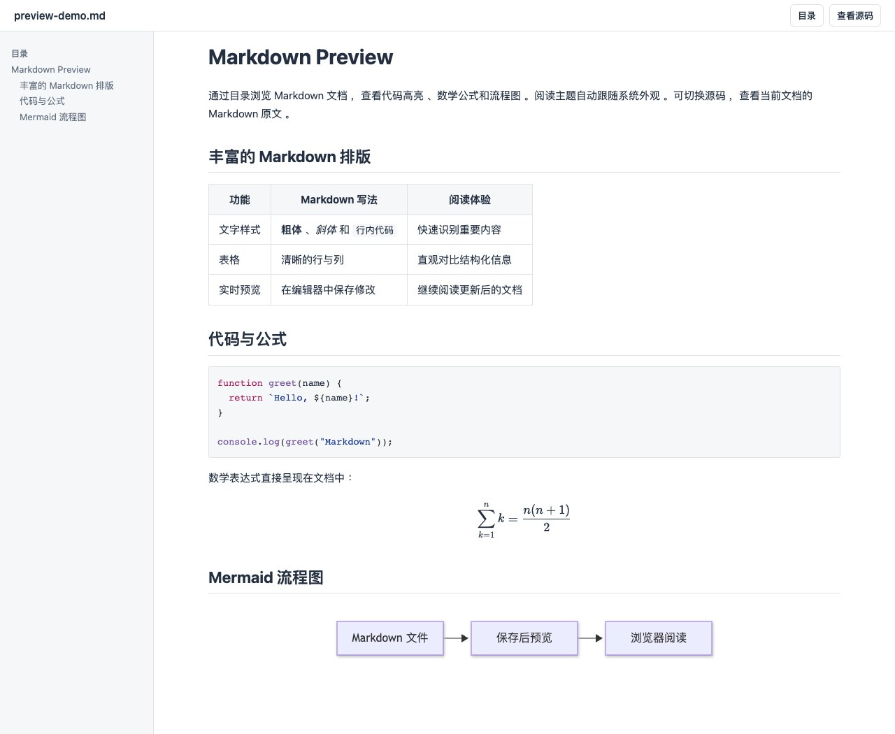
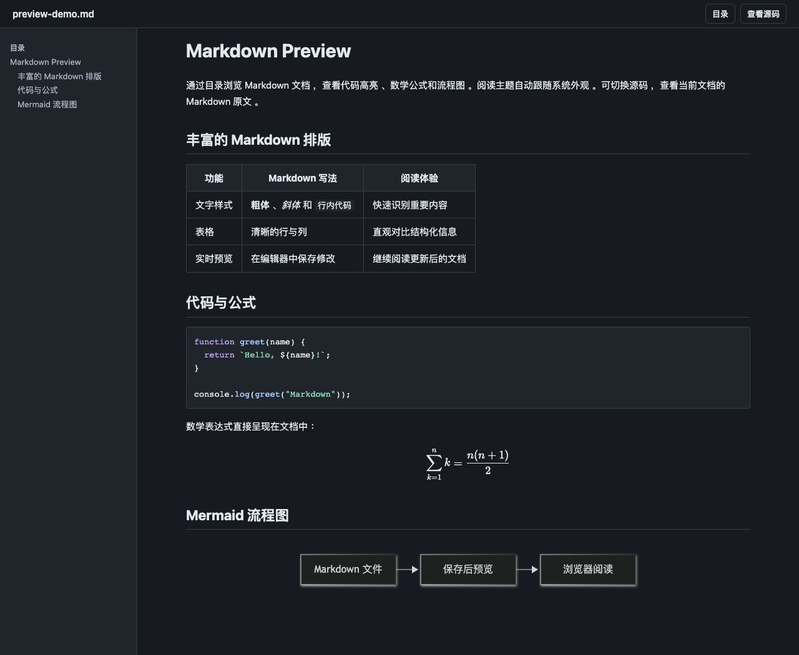

# Markdown Preview

Markdown Preview 为 Codex 提供 Markdown 预览（Markdown preview），支持 `.md` 和 `.markdown`。在 Codex 文件标签页阅读文档，也可打开独立浏览器预览；保存 Markdown 后，正文、源码和目录自动更新。渲染基于 [Crossnote](https://github.com/shd101wyy/crossnote)。

## 功能

- 标题目录、表格、任务列表和代码语法高亮。
- KaTeX 数学公式、Mermaid 图表、本地图片，以及本地文件和外部链接。
- 阅读与源码视图切换、选区复制，主题自动跟随系统。
- 保存后更新预览，保留阅读位置、源码视图和目录设置。
- 在默认浏览器阅读同一文件，适合分屏或另一块屏幕查看文档。
- 只读展示，禁用文档脚本、代码执行和文件导入。

## 预览截图

以下截图展示实际浏览器阅读页，包含目录导航、KaTeX 公式、Mermaid 图表和代码高亮。





## 安装

推荐通过 Codex 插件市场安装。需要 Node.js 22.12.0 或更新版本、Git 和支持 `plugin` 命令的 Codex CLI；`node` 必须在 `PATH` 中。市场包已携带运行依赖，无需 npm。

```sh
codex plugin marketplace add Maker-Wen/markdown-preview --ref codex/marketplace
codex plugin add markdown-preview@markdown-preview-marketplace
```

需要从本地源码安装时，见[开发指南](docs/development.md#本地源码安装)。

## 更新

需要检查已注册市场并安装更新时，执行：

```sh
codex plugin marketplace upgrade markdown-preview-marketplace
codex plugin add markdown-preview@markdown-preview-marketplace
```

插件更新后重新打开预览；已有页面不保证立即载入新的插件代码。

## 使用

安装后打开新的 Codex 聊天，在 Markdown 文件的查看器菜单中选择 **Open in ChatGPT → Markdown Preview** 。Codex 使用保存的首选查看器；选择 **Built-in** 可返回内置查看器。

## 使用范围

- 本地图片仅从文档目录及其子目录读取；外部图片以说明文字替代。
- 保存文件后自动刷新预览；宿主不支持自动刷新时，页面会显示提示。
- 点击“在浏览器打开”可在默认浏览器阅读，并跟随当前文件保存自动刷新；使用时保持 Codex 聊天开启。
- 文档内标题链接支持页内跳转；跨文件标题链接只打开目标文件。
- 本地文件链接需要宿主提供 `openai/files` 扩展。
- 实际处理能力取决于内容复杂度、可用内存和宿主限制。

## 开发与文档

- [开发指南](docs/development.md)：环境准备、测试和本地源码安装。
- [兼容性说明](docs/compatibility.md)：Codex 查看器行为与宿主接口。
- [分发说明](docs/distribution.md)：市场构建、更新和发布。
- [发布指南](docs/releasing.md)：维护者的 GitHub Release 与远程安装脚本流程。
- [插件发现与上架](docs/plugin-discovery.md)：公开安装入口与官方目录评估。
- [更新日志](CHANGELOG.md)与 [Markdown 示例](plugins/markdown-preview/tests/fixtures/markdown-sample.md)。

## 作者

[yomori](https://github.com/Maker-Wen) 维护本插件。问题和功能建议可提交到 [GitHub Issues](https://github.com/Maker-Wen/markdown-preview/issues)。

## 致谢

感谢 [Crossnote](https://github.com/shd101wyy/crossnote)、[KaTeX](https://github.com/KaTeX/KaTeX)、[Mermaid](https://github.com/mermaid-js/mermaid) 和 [Prism](https://github.com/PrismJS/prism) 的作者及贡献者。Crossnote 的许可见 [LICENSE](https://github.com/shd101wyy/crossnote/blob/develop/LICENSE.md)。
